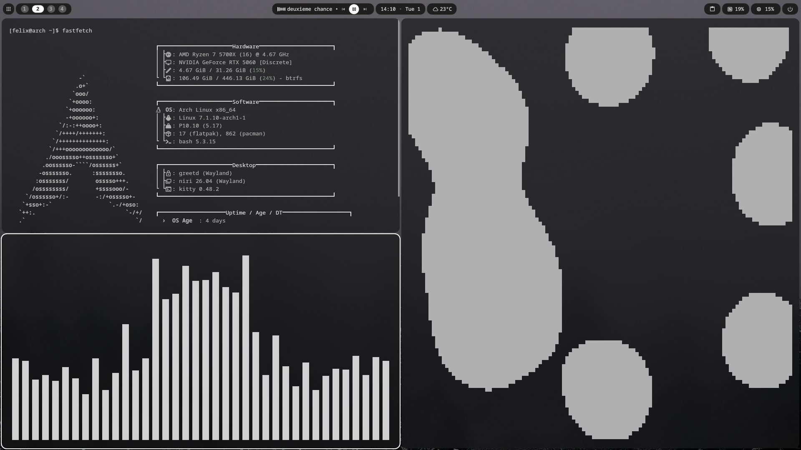

# dotfiles

My personal configuration files for Arch Linux.

Managed with [GNU Stow](https://www.gnu.org/software/stow/).

## Setup

* OS: Arch Linux
* WM: Niri
* Shell: DankMaterialShell
* Terminal: Kitty
* Fetch: Fastfetch
* System monitor: btop
* Audio visualizer: Cava
* Discord client: Vesktop

## Configs

```text
btop/
cava/
dms/
fastfetch/
gtk3/
gtk4/
kitty/
niri/
qt6ct/
vesktop/
```

## Installation

```bash
git clone git@github.com:f3lixzv/dotfiles.git ~/dotfiles
cd ~/dotfiles
stow */
```

## Updating

```bash
cd ~/dotfiles
git add .
git commit -m "Update dotfiles"
git push
```


